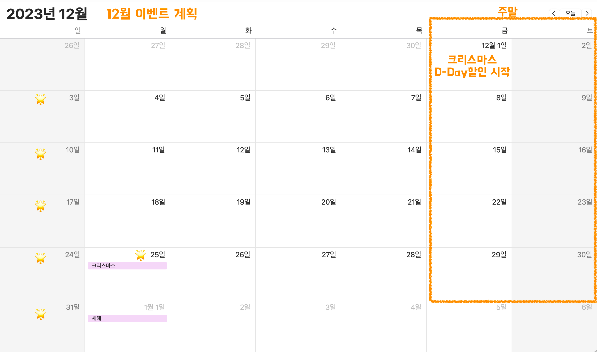
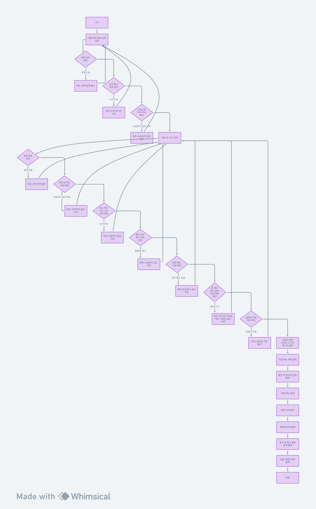

# 🎄 크리스마스 프로모션

## 📌 프로젝트 기능 한줄 소개

방문 일자와 주문한 메뉴 정보를 기반 으로 할인 및 이벤트 혜택을 계산하여 출력하는 프로그램입니다.

## 📌 프로젝트 이해에 필요한 배경 지식

- 사용자가 주문할 수 있는 메뉴는 아래와 같다.

```text
<애피타이저>
양송이수프(6,000), 타파스(5,500), 시저샐러드(8,000)
    
<메인>
티본스테이크(55,000), 바비큐립(54,000), 해산물파스타(35,000), 크리스마스파스타(25,000)
    
<디저트>
초코케이크(15,000), 아이스크림(5,000)
    
<음료>
제로콜라(3,000), 레드와인(60,000), 샴페인(25,000)
```

- 2023년 12월 달력은 아래와 같다.
  

## 📌 기능 요구 사항

### 1️⃣ 12월달 예상 “방문 날짜”를 사용자로부터 입력 받을 수 있다.

---

```text
안녕하세요! 우테코 식당 12월 이벤트 플래너입니다.
12월 중 식당 예상 방문 날짜는 언제인가요? (숫자만 입력해 주세요!)
```

- [x] 사용자는 12월 중 식당 예상 방문 날짜를 입력한다.
- [x] 사용자는 공백을 입력할 수 없다.
    - ✅ `1`
    - ⚠️ `(공백)`
    - 🗨️ `[ERROR] 공백은 입력할 수 없습니다. 다시 입력해 주세요.`
- [x] 사용자는 숫자 형식이 아니면 입력할 수 없다.
    - ✅ `1`
    - ⚠️ `one`
    - ⚠️ `first`
    - 🗨️ `[ERROR] 유효하지 않은 날짜입니다. 다시 입력해 주세요.`
- [x] 사용자는 12월 날짜인 1 이상 31 이하의 숫자(날짜)만 입력할 수 있다.
    - ✅ `1`
    - ✅ `31`
    - ⚠️ `-1`
    - ⚠️ `0`
    - ⚠️ `32`
    - 🗨️ `[ERROR] 유효하지 않은 날짜입니다. 다시 입력해 주세요.`

<br>

### 2️⃣ 주문할 메뉴와 개수를 사용자로부터 입력 받을 수 있다.

---

```text
주문하실 메뉴를 메뉴와 개수를 알려 주세요. (e.g. 해산물파스타-2,레드와인-1,초코케이크-1)
티본스테이크-1,바비큐립-1,초코케이크-2,제로콜라-1
```

- [x] 사용자는 주문할 메뉴와 개수를 입력한다.
- [x] 사용자는 공백을 입력할 수 없다.
    - ✅ `티본스테이크-1,아이스크림-1`
    - ⚠️ `(공백)`
    - 🗨️ `[ERROR] 공백은 입력할 수 없습니다. 다시 입력해 주세요.`
- [x] 사용자는 메뉴판에 있는 메뉴를 입력해야 한다.
    - ✅ `티본스테이크-1,아이스크림-1`
    - ⚠️ `고향집밥-1,티본스테이크-1,아이스크림-1`
    - ⚠️ `고향집밥-1,어머니의손맛불고기-1`
    - 🗨️ `[ERROR] 유효하지 않은 주문입니다. 다시 입력해 주세요.`
- [x] 사용자는 주문하는 메뉴에 대한 개수를 최소 1개부터 입력해야 한다.
    - ✅ `티본스테이크-1,아이스크림-1`
    - ⚠️ `티본스테이크-0,아이스크림-1`
    - 🗨️ `[ERROR] 유효하지 않은 주문입니다. 다시 입력해 주세요.`
- [x] {메뉴}-{개수},{메뉴}-{개수} 형식으로 입력 해야 한다.
    - ✅ `티본스테이크-1,바비큐립-1,초코케이크-2,제로콜라-1`
    - ⚠️ `티본스테이크:1,바비큐립:1,초코케이크:2,제로콜라:1`
    - 🗨️ `[ERROR] 유효하지 않은 주문입니다. 다시 입력해 주세요.`
- [x] 사용자는 중복 메뉴를 입력할 수 없다.
    - ✅ `티본스테이크-1,아이스크림-1`
    - ⚠️ `티본스테이크-1,티본스테이크-1,아이스크림-1`
    - 🗨️ `[ERROR] 유효하지 않은 주문입니다. 다시 입력해 주세요.`
- [x] 총 메뉴 개수는 20개까지만 가능하다.
    - ✅ `티본스테이크-10,아이스크림-10`
    - ✅ `티본스테이크-20`
    - ⚠️ `티본스테이크-10,아이스크림-10,시저샐러드-1`
    - 🗨️ `[ERROR] 총 주문 가능한 메뉴 수량은 20개 이하입니다. 다시 입력해 주세요.`
- [x] 음료만 주문할 수 없다.
    - ✅ `초코케이크-1,제로콜라-5,레드와인-5`
    - ⚠️ `제로콜라-5,레드와인-5`
    - ⚠️ `제로콜라-1`
    - ⚠️ `제로콜라-20`
    - 🗨️ `[ERROR] 음료만 주문할 수 없습니다. 다시 입력해 주세요.`

<br>

### 3️⃣ 이벤트 혜택 미리보기 안내 메시지를 출력할 수 있다.

---

```text
12월 3일에 우테코 식당에서 받을 이벤트 혜택 미리 보기!
```

<br>

### 4️⃣ 사용자가 주문한 주문 메뉴 목록을 출력할 수 있다.

---

```text
<주문 메뉴>
티본스테이크 1개
바비큐립 1개
초코케이크 2개
제로콜라 1개
```

- [x] 주문 메뉴의 출력 순서는 자유롭게 출력한다.

<br>

### ️ 5️⃣ 할인 전 총주문 금액을 계산하고 출력할 수 있다.

---

```text
<할인 전 총주문 금액>
142,000원
```

- [x] 주문한 총 금액을 계산해서 출력한다.
- [x] 할인 전 총주문 금액은 1,000 단위로 (,)를 표시한다.
- [x] 할인 전 총주문 금액은 0원이 될 수 없다.
    - ✅ `할인 전 총주문 금액 : 142,000`
    - ⚠️ `할인 전 총주문 금액 : 0`
    - 🗨️ `[ERROR] 할인 전 총주문 금액은 0원이 될 수 없습니다.`

<br>

### 6️⃣ 할인 전 총주문 금액에 따라 증정 메뉴를 선정하고 출력할 수 있다.

---

```text
<증정 메뉴>
샴페인 1개
```

- [x] 할인 전 총주문 금액에 따라 증정 메뉴를 선정하고 이를 출력한다.
- [x] 할인 전 총주문 금액이 120,000 원 이상일 때, 샴페인 (25,000원) 1개 증정 가능하다.
- [x] 증정 이벤트에 해당하지 않는 경우, 증정 메뉴에 "없음"으로 보여 준다.
    ```text
    <증정 메뉴>
    없음
    ```

<br>

### 7️⃣ 방문하는 날짜에 받을 수 있는 혜택 내역을 계산하고 출력할 수 있다.

---

```text
<혜택 내역>
크리스마스 디데이 할인: -1,200원
평일 할인: -4,046원
특별 할인: -1,000원
증정 이벤트: -25,000원
```

- [x] 각각의 할인 & 이벤트 별로 어느 정도의 혜택이 들어갔는지 계산하고 출력한다.
- [x] ‘할인 전 총주문 금액’이 10,000원 이상부터 할인 & 이벤트가 적용될 수 있다.
- [x] 할인 & 이벤트 진행 방법은 아래와 같다.
    ```text
    ⭐ 크리스마스 디데이 할인 (2023.12.1 ~ 2023.12.25)
    - 1,000원으로 시작하여 크리스마스가 다가올수록 날마다 할인 금액이 100원씩 증가
    - 12월 1일에 1,000원으로 할인 금액
    - 12월 2일에 1,100원으로 할인 금액
    - …
    - 12월 25일에 3,400원으로 할인 금액
    - 평일, 주말에 상관 없이 적용 된다.

    ⭐ 부가 할인 및 증정 이벤트 (2023.12.1 ~ 2023.12.31)
    - 평일 할인 (일요일~목요일)
      - 평일 할인 기간에 디저트 메뉴를 메뉴 1개당 2,023원 할인한다.
    - 주말 할인 (금요일,토요일)
      - 주말 할인 기간에 메인 메뉴를 메뉴 1개당 2,023원 할인한다.
    - 특별 할인 (3일, 10일, 17일, 24일, 25일, 31일)
      - 이벤트 달력에 별이 있으면 할인 전 총주문 금액에서 1,000원 할인
    - 증정 이벤트
      - 할인 전 총주문 금액이 120,000원 이상일 때 샴페인 1개 증정
    ```
- [x] 고객에게 적용된 이벤트 내역만 보여 준다.
    - 만약 평일 할인, 주말할인을 받을 수없다면 아래의 예시처럼 2개의 행 전체를 표시하지 않는다.
        ```text
        <혜택 내역>
        크리스마스 디데이 할인: -1,200원
        특별 할인: -1,000원
        증정 이벤트: -25,000원
        ```
- [x] 고객에 적용된 이벤트가 하나도 없다면 혜택 내역에 "없음"으로 표시한다.
    ```text
    <혜택 내역>
    없음
    ```
- [x] 혜택 내역에 여러 할인 & 이벤트가 적용된 경우, 출력 순서는 자유롭게 출력한다.
- [x] 할인 된 금액은 “-” 마이너스 부호를 사용한다.
- [x] 할인 된 금액은 1,000 단위로 (,)를 표시한다.

<br>

### 8️⃣ 총혜택 금액을 출력할 수 있다.

---

```text
<총혜택 금액>
-31,246원
```

- [x] 총혜택 금액을 계산하여 출력한다.
    - ‘할인 전 총주문 금액’ 10,000원 이상에 해당하지 않아 할인 혜택 내역이 “없음”인 경우는 총혜택 금액도 없음으로 0원으로 출력한다.
        ```text
        <총혜택 금액>
        0원
        ```
- [x] 총혜택 금액 = 할인 금액의 합계 + 증정 메뉴의 가격
    - 할인 전 총주문 금액이 120,000원이 넘지 않아, 증정 이벤트에 해당하지 않는 경우는 증정 메뉴의 가격을 0원으로 간주한다.
- [x] 총혜택 금액은 마이너스 부호(“-”)와 함께 출력한다.
- [x] 총혜택 금액은 1,000 단위로 (,)를 표시한다.
- [x] 총혜택 금액은 음수 값을 가질 수 없다.
    - ✅ `총혜택 금액 : 5000`
    - ✅ `총혜택 금액 : 0`
    - ⚠️ `총혜택 금액 : -1`
    - ⚠️ `총혜택 금액 : -1000`
    - 🗨️ `[ERROR] 총 혜택 금액은 0원 이상이어야 합니다.`

<br>

### 9️⃣ 할인 후 예상 결제 금액을 계산하여 출력할 수 있다.

---

```text
<할인 후 예상 결제 금액>
135,754원
```

- [x] 할인 후 예상 결제 금액을 계산하여 출력한다.
- [x] 할인 후 예상 결제 금액 = 할인 전 총주문 금액 - 할인 금액
    - ❗여기서, 할인 금액에는 증정 이벤트 메뉴의 가격을 포함하지 않는다❗
- [x] 할인 후 예상 결제 금액은 1,000 단위로 (,)를 표시한다.
- [x] 할인 후 예상 결제 금액은 음수 값을 가질 수 없다.
    - ✅ `할인 후 예상 결제 금액 : 5000`
    - ✅ `할인 후 예상 결제 금액 : 0`
    - ⚠️ `할인 후 예상 결제 금액 : -1`
    - ⚠️ `할인 후 예상 결제 금액 : -1000`
    - 🗨️ `[ERROR] 결과 주문 총액은 0원 이상이어야 합니다.`

<br>

### 🔟 총 혜택 금액에 따라 12월 이벤트 배지를 선정하고 출력할 수 있다.

---

```text
<12월 이벤트 배지>
산타
```

- [x] 총혜택 금액에 따라 이벤트 배지의 이름을 다르게 보여 준다.
    - 5,000원 이상: 별
    - 10,000원 이상: 트리
    - 20,000원 이상: 산타
- [x] 위의 조건에 해당하지 않아 이벤트 배지가 부여되지 않는 경우, "없음"으로 보여 준다.
    ```text
    <12월 이벤트 배지>
    없음
    ```

<br>

## 📌 적절한 할인을 받는 경우의 전체 입출력 예시

```text
안녕하세요!우테코 식당 12월 이벤트 플래너입니다.
12월 중 식당 예상 방문 날짜는 언제인가요?(숫자만 입력해 주세요!)
3
주문하실 메뉴를 메뉴와 개수를 알려 주세요.(e.g.해산물파스타-2,레드와인-1,초코케이크-1)
티본스테이크-1,바비큐립-1,초코케이크-2,제로콜라-1
12월 3일에 우테코 식당에서 받을 이벤트 혜택 미리 보기!

<주문 메뉴>
티본스테이크 1개
바비큐립 1개
초코케이크 2개
제로콜라 1개

<할인 전 총주문 금액>
142,000원

<증정 메뉴>
샴페인 1개

<혜택 내역>
크리스마스 디데이 할인:-1,200원
평일 할인:-4,046원
특별 할인:-1,000원
증정 이벤트:-25,000원

<총혜택 금액>
-31,246원

<할인 후 예상 결제 금액>
135,754원

<12월 이벤트 배지>
산타
```

<br>

## 📌 할인을 하나도 받지 못하는 경우의 전체 입출력 예시

```text
안녕하세요!우테코 식당 12월 이벤트 플래너입니다.
12월 중 식당 예상 방문 날짜는 언제인가요?(숫자만 입력해 주세요!)
26
주문하실 메뉴를 메뉴와 개수를 알려 주세요.(e.g.해산물파스타-2,레드와인-1,초코케이크-1)
타파스-1,제로콜라-1
12월 26일에 우테코 식당에서 받을 이벤트 혜택 미리 보기!

<주문 메뉴>
타파스 1개
제로콜라 1개

<할인 전 총주문 금액>
8,500원

<증정 메뉴>
없음

<혜택 내역>
없음

<총혜택 금액>
0원

<할인 후 예상 결제 금액>
8,500원

<12월 이벤트 배지>
없음
```

<br>

### 📌 프로젝트 플로우 차트




